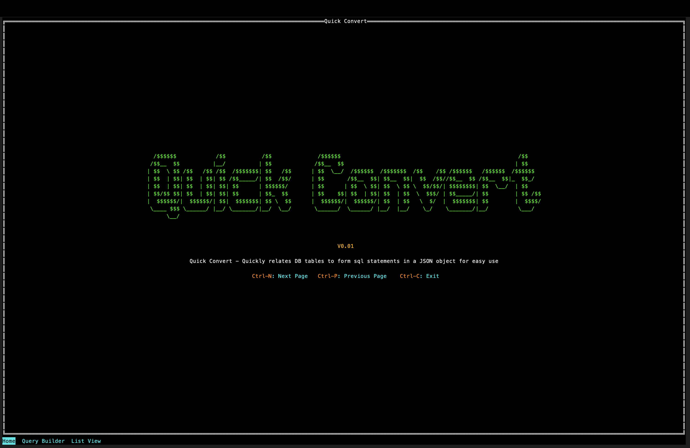
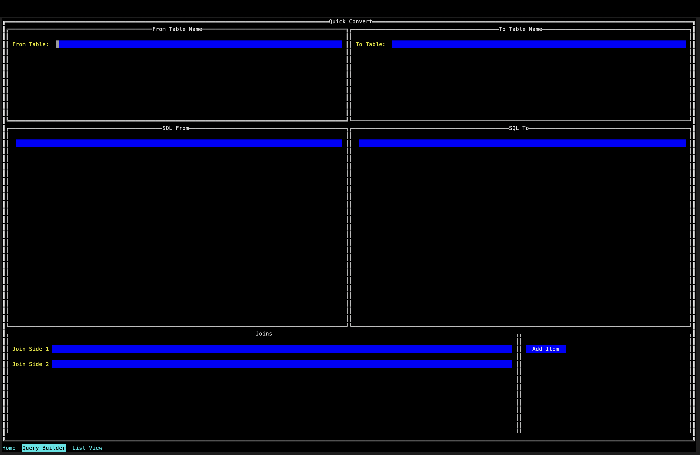
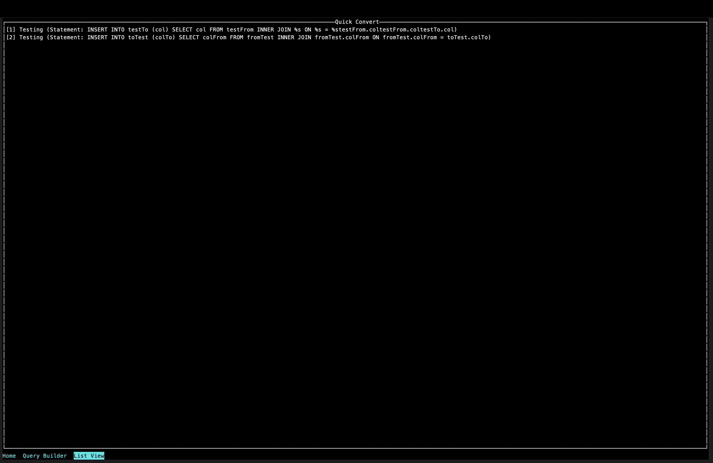
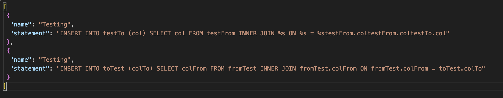

# quick-convert

Used to quickly build sql statmements while documenting conversions of Database tables.

Use Case: A client comes from software XYZ and needs to be converted. Using this tool we document everything that we need to convert them over to our system. This tool outputs the json file see below. That file is then loaded into a Blu Star system that goes through the steps and executes the insert statements. This json file is then marked as usable with XYZ software and the next time a client using XYZ software needs to be converted instead of going through the process we just reuse the json file.

Use Case: A client comes in from an already known and converted software and asks if they could see if their data would work on our system. We load the json file that corisponds with their software source into a Blu Star page that runs all of the select statements and outputs it in a csv file for use in a spreadsheet program so they can verify their data before we convert them over.

Use Case: A dev wants to see the relations between their data and ours. Quickly convert the KVPs to both a to and from spreadsheet to fill out the data tracking.

## Install

1. Go to the [releases page](https://github.com/GrantP-Collabetive/quick-convert/releases)
2. Find the file called convert
3. Download the .exe if you are using Windows or the one just called convert if you are using a Unix system
4. Run the executable. There is no install process it should just open.

## How to build locally

This tool is built on [Go](https://go.dev)

1. [Install](https://go.dev/dl/) go on your system
2. pull the Latest Version of Quick Convert from github
3. Open a terminal at the root of the Quick Convert folder
4. Run the command `go get .`
5. Launch the program using `go run .`
6. Build using `go build .`

## TODO Tasks

- [❌] Dynamically add input fields for columns and joins so there are always n+1 rows
- [❌] Accommodate dynamic inputs in the string builder
- [❌] Drop down lists to allow the user to select different join types
- [❌] Where clause input
- [❌] Delete button on list page to delete items from json object
- [❌] Create select statements to go with input statements
- [❌] Update the json to have a documented relation between tables and their columns
- [❌] Update json stuct to use this format {stepName, toTableName, fromTableName, fromToColRelations[], toFromColRelations[], selectStatement, insertStatement}
- [❌] Listview displays json in beautified format
- [✅] Packaged executable/enviroment for ease of use
- [❌] Load saved steps back into the program use the fromToColRelations for this
- [❌] Allow Editing of steps
- [❌] Make forms have scrolling for overflowed content

## Ideal Json Output Example

`
[
  {
    "stepName": "Application Users",
    "toTableName": "t_application_users",
    "fromTableName": "temployee",
    "fromToColRelations": [
      {"temployee.employeeid": "t_application_users.application_user_key"},
      {"temployee.employeenumber": "t_application_users.user_name"},
      {"tcontacts.lastname": "t_application_users.last_name"},
      {"tcontacts.firstname": "t_application_users.first_name"},
      {"tcontacts.emailaddress": "t_application_users.email"},
      {"temployee.additionalphone": "t_application_users.phone"},
      {"temployee.mobilephonenumber": "t_application_users.mobile"},
      {"temployee.supervisorid": "t_application_users.supervisor_id"},
      {"temployee.istechnician": "t_application_users.technician_flag"}
    ],
    "toFromColRelations": [
      {"t_application_users.application_user_key": "temployee.employeeid"},
      {"t_application_users.user_name": "temployee.employeenumber"},
      {"t_application_users.last_name": "tcontacts.lastname"},
      {"t_application_users.first_name": "tcontacts.firstname"},
      {"t_application_users.email": "tcontacts.emailaddress"},
      {"t_application_users.phone": "temployee.additionalphone"},
      {"t_application_users.mobile": "temployee.mobilephonenumber"},
      {"t_application_users.supervisor_id": "temployee.supervisorid"},
      {"t_application_users.technician_flag": "temployee.istechnician"}
    ],
    "selectStatement": "SELECT col FROM fromTable INNER JOIN t_table_1.col on t_table_1.col = t_table_2.col",
    "statement": "INSERT INTO toTable (toCol) SELECT fromCol FROM fromTable INNER JOIN t_table_1.col ON t_table_1.col = t_table_2.col"
  }
]
`

## Contributing

Anyone is free to contribute. To contribute code please create a branch and when ready a pr requesting the banch merge and I will review it as soon as possible. To contribute ideas and feedback please open an Issue in the repository and I will review it. Please do not fork unless you need to.
